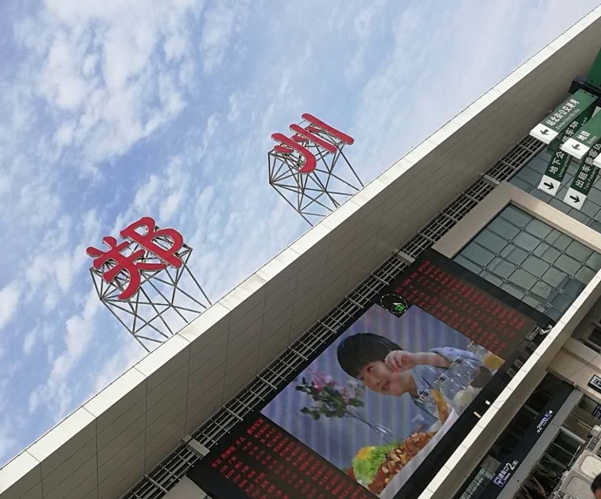

# 郑州

出发实习的前一天晚上，此句话仅用作测试。

在前往郑州之前，听到过很多次《关于郑州的记忆》这首民谣的名字。直到今早出发前我才找来听了听，我与其中一句相似：

> 多少次在火车上路过这城市

作为一名土生土长的西安人，一旦需要陆路南下，必然经过郑州。这次我来不为寻找爱情，只是为了实习。说来最近又抱起了扔下了四五年的吉他，刚弹了快一个半月，长起了一层的茧子，这次又被停下了。高中时我那所谓的学吉他，就只去学习了和弦按法与右手的旋律，然后就那么跟着唱着胡乱配合到一起。而这次我老老实实从基础开始，从靠弦法弹音节开始，整一个月都没练到和弦。

老姚静心地选歌还是很棒的，从儿歌到《莫斯科郊外的晚上》再到我目前最喜欢的英国民谣《绿袖子》。有时总感觉会听音阶了，明白节拍会看简谱了之后，好像都能透过歌词感受到情感。也许我该在此特意记下时间 6 月十四号一点五十，我终于坐上了前往郑州的高铁。

到了现在我还是每次出行时都选择窗边的座位，总希望着能通过窗外望见点熟悉景象。但想来家住南郊的我，对西安北郊的地貌好像也只能通过从北客站出发的列车来了。途径郑州的这一路高铁我坐过有个三四次，这次好像还是发现了点熟悉的景象。从西安南边环绕过来的秦岭，到了临潼这边便被称为了骊山，如果你从西安绕城开车驶来，不久便能发现一山脚 —— 缓缓的斜着平铺下来，顶上好像有一座亭子，那是烽火台。那山便是骊山没错了。见过骊山后你再来南边的秦岭，映入眼前的高大会让你不觉地比较，骊山才到它哪啊，有一半吗？视野再回到高铁上，列车右侧途经的一座白花花的山便是华山。华山，上次爬你的时候碰见了能见度不足五米大雾，我还会再爬你一次。一个有意思的景象，当遇见与高铁平行的高速时，碰巧高铁也在减速进站。就进站时那种慢悠悠的速度就然是与相平行高速上发生超车时的速度一致。不一样的坐标系与不一样的心态。

陌生的城市总是对我很有吸引力，我会在到达前做够准备，了解有关的吃喝娱乐对我来说也是很享受的事情。与不同的人同行面对不同的陌生城市，都会有不一样的做法与准备。一个人的出行总是会想方设法的凑活，能省一点是一点；要是跟舍友们一起，那就是一起能省就省。

一出郑州车站我还是第一次遇见了找不见方向摸不见路的情况，还有暴晒加上手机导航的方向总是乱指，好在郑州的人感觉都很好。我慢慢走去了网上销量最高的羊肉烩面店，前台收银看我是在网上走的优惠券，一大碗羊肉面加上两份凉菜共 19 块钱。她只是说道我们这样买真的不赚钱，后再就没多说，反倒是让我选两道凉菜时不进夹得高得冒起，还给我送了少量的第三份。我相信她说的不赚钱这句不是抱怨，而且她说的也很是时候。将一个坏消息放在好消息的前头，怎么都比将一个小的坏消息放在一对好消息后面强，人总是有损失厌恶的嘛。

小区家里紧楼上有过一阵子的合租房，那时我对这个概念并不理解。只知道那是房东将一户分割开来并同时租给多个租客的模式。有时我在楼下能听见租客们的吵架声，有时又有踢里哐啷租客们的拆家声。同在一户的陌生人共用卫生间多不方便，在那样的小房间里小两口怎么培养感情。这些问题现在看来，答案就是省钱。我这次住下的带阳台有空调的小卧室，算是可选范围里的精品，之后多多少少补充点盆呀衣架床上三件套呀什么的，一千四五就过去了。若不是这次出来实习有父亲的赞助，自己那点日薪怎撑得住。

到岗第一天，一切都挺好的，分到一工位这是很正常的吧，划给我一企业邮箱就是有点意外了。企业邮箱这个玩意我最早听说，好像还是来自谋篇报道各大公司对 Linux 内核贡献的评比中。那时看到各种有名气的、眼熟的公司域名都感觉好想加入！说来自己以前也都没干过兼职，现在想来兼职与实习应该还是有差别的吧。拿以天为单位的实习来说，公司怎舍得花费一天的时间来让你熟悉工作环境呢。 而对实习生舍得花时间花精力那一定是有原因的，这里姑且猜测一下：

* 要么是你的总工作时长为公司带来的价值，不可被切分为零散工作日的叠加；
* 你的产出会有持续的复利效应；
* 你的每日产出能力将成线性或非线性增长。

将这些猜测写完后才觉得，这三点更像是一种对自己工作能力的要求。 现在写下这段文字的时候已经是到岗的第三天晚上了，哈哈哈，到这里又到了周四的晚上了。这几天晚上确实是在忙一些工作上的事情，说实在的到现在发生了的一些事情还是与自己预期不一样的。

我有时也会发现自己当下所在的环境算是自己的舒适区，应该立马跳出来，接着就会想现在会不会有机会跳入到一个新环境里；当然有时也会是自己做出一点准备。这次来到郑州实习就是这么一个情况，毕竟今年这个情况一下子在家呆了六个月，如果暑假的时间里还不出去走走，就一下得呆个八个月。况且在家的那段日子里也过得不如意，还说过要是早知道放这么久就会有别的打算。想起来《活出生命的意义》中曾说过：

> 精神健康有赖于一定程度的紧张——即已完成的和有待完成的任务之间的紧张，或者是当下状态与理想状态之间的差距。这种紧张是人固有的，也是精神健康所必不可少的。

本书英文名为 **Man's Search for meaning**，上面那句还不是它最常被引用到的，而是这句：

> 人不应该问他的生命之意义是什么，而必须承认是生命向他提出了问题。简单地说，生命对每个人都提出了问题，他必须通过对自己生命的理解来回答生命的提问。对待生命，他只能担当起自己的责任。

不同的人都有着不同的生活方式，都有着不同的家不同的价值观，不一样的活法。前两天走在回住处的路上，看到推着小孩的老太太竟然捡起被丢在地上的烟盒，甩给她的小孩当作玩具；这场景让我有一种说不出的难受。在上下班每天的路上都有太多有感触的景象，印象挺深的有一只除了头部，毛都被剃光了的狗。关键拴着它的链子也刚刚拘在他脖子处，也就是那有毛地方和没毛地方的分界处——好像是它主人连在剃毛时都没有给它卸下链子。那短短的铁链就把它那样拴着，脏兮兮的。如果你只能看到它的头部，会感觉它好像还有一丝的威严；你要还能看到它的脖子以下，取代它威严感的将会是瘦弱，它那瘦弱又没有毛发装饰的身体好像支撑不主头部的威严。

来到郑州实习跟来到郑州旅行还是不太一样的，之前我也有想过要来郑州转转看，那会好像就是只想着来盲目的看看。现在有这个机会了但实习和收假后的期末考压在身上，总感觉出去玩太多有点对不起自己，但周内在忙着挣钱好像就能说的过去了。

大学生早点出来实习，我认为这会有利于你建立职业的认同感。每天与同事一起生活一起工作，或多或少都能感受出未来工作的一二，有时还有你们双方吹的牛不都包括这对本职业的向往吗，还有讲述某某前辈的成长之路。

上班时零碎的想法会冒出来挺多的，可惜都没有记下只能凭记忆会想起点印象较深的了。想起八二法则在技术届可能也是适用的吧，我无法估量全球是否有百分之二十程序员才是在产出有价值的核心代码，而剩余的百分之八十的程序员所在做的不过就是先学会使用再学会结合；再看看微信的公众号生态，又有多少号主是能持续长期地产出高价值内容呢？又有多少的账号在做的不过就是搬运甚至洗稿吗？当你再搜索引擎上搜索一个程序报错时，你不难会遇见同一个操作内容分别位于不同网站的情况。80% 的人在围着 20% 的能持续长期地产生高价值内容的人团团转。

当你在跟别人一起讨论的时候，可不能抱有一定要说服对方的想法，然后就沉浸在无脑地为自己辩护的状态。说到这就再分享一些最近在读的《超越感觉》**Beyond Feelings** 中的思想吧：

> 我们应该如何看待个性？不是把它视为我们生来具有的，而是后天获得的 —— 或者更准确地说，是赢得的。个性始于这样的认知：不可能逃脱受他人和环境的影响。个性的本质就是警惕。下面的知道原则将帮助你达到这一点：
>
> 1. 把你对任何人、议题或情势的第一反应看作是尝试性的。
> 2. 判断你为什么会做出这种反应。
> 3. 考虑你有可能对这个人、议题或情势做出的其他可能的反应。
> 4. 询问你自己是否还有其他比你的第一反应更恰当的反应。

上文的摘录还是作者给你的思考方法，下面的是我在书边写有‘可怕’二字的段落：

> 我们大多数所谓的推理在于为继续相信我们已经相信的东西找到理由。

还有：

> 感知是没有缺点的吗？几乎不可能。首先，它受我们的欲望、兴趣和期望的影响：“感知从一开始就是有选择的，并倾向于简化我们周围的世界。记忆持续并加速了这个过程。”

当你在与别人交流时甚至可以放到搭讪这件事上，你需要想的是如何说如何做才会让对方舒服。你的注意力应该是处在让对方舒服这件事上的，这样你就可以避免注意力过度集中于自身从而给自己平添周围环境的压力。

迟来的端午问候，我的第一个带薪小长假过的薪资还不够郑州西安的往返高铁钱，如果这是个四天的小长假那还刚好够买个往返车票。这些东西写到这里，其实我自己好像也没有个什么明确的走向，只是知道自己所在记录的便是自己的成长，成长不断这些字也就应该也写不完。

一天的时间里高铁站都有太多的人穿梭而过，吞吐量巨大，而你也不过是在其中仅仅呆了一段时间而已。可在这么短的一段时间里，又会有多少人将跟你产生一点联系呢？哪怕是只有一位在等着你，或是你在等着她，那都将是件很美妙的事情。这里解用笑来老师的一个概念，七年就是一辈子；我感觉啊你的 7 年就像是一次次出入不同的高铁站。时时刻刻都有不少人或着急忙慌地或不急不忙地涌入，每人涌入前的境况都不同自然所能接受的仓位也就不同。可能头几个七年里你还没长到一米二，有个成年人陪同就能免费上车，就这时也有人跟着上了私人飞机也有人跟着硬站；可过后谁有会舍得一路终其一生来抱怨此时的不平等呢？

这两天翻译了一篇有关搭建区块链应用的文章，就引起了点我的研究兴趣，随后听了边曹大的区块链课程正是由此知道了以太猫这个玩意。本着对技术的探寻还有对小宠物的喜爱，还得加上其图片本身设计的讨喜，我就按教程充值了最小额度一百元的以太币。这里需要引以为戒的是你都还没真正搞清楚以太坊明确定义，还有更多的相关概念对你来说都是未知的时，你就太急于尝试着去拥有。你就像那彻彻底底的无知还不是最要命的，稍懂一点时的愚昧才是最致命的。

回过头来看看你之前做出的那些烂选择，无非就是以下两种情况：

* 要么是陷入到了一件你完全不了解的事情当中；
* 要么是正处在那愚昧之巅的自以为是当中；

下面放上[达克效应](https://zh.wikipedia.org/zh-hans/%E9%84%A7%E5%AF%A7-%E5%85%8B%E9%AD%AF%E6%A0%BC%E6%95%88%E6%87%89)的图片：

郑州，

> 轻轻的我走了， 正如我轻轻的来；

这突然间的离开，正如我那悄无声息的到来。不管怎么说怎么看，你都对我有着特殊的意义。来你这里有半个月了，我可谓是足不出户与公司啊。除了这片生活区与科技园区，还有高铁站与路上途径的那座电站，我就再也无法为别人描述关于你的更多。来时就一个背包一个拉杆箱，走时多了一套被褥。也许是刚到达郑州的那一天里又是高铁票又是租房又是押金的，一下刺激的都不舍得买套好被褥。尤其是在最开始的两个晚上，没有褥子的过度与床垫的直接接触实在让人有点受不了。铺上了窄一截子的褥子后，虽然梦乡里的活动会受限，但已不会再半夜难受到清醒。现在想来这个做法着实有点可笑，这就与人生中你没选择对什么是重要的事情一样。明知道眼睛的重要，却还总是使劲盯着电脑贴脸盯着手机，明知道体质的重要，却总有无数的借口不缺运动。

为什么有时一个小物件就会对一个人很重要呢？这里不是说像房子、床垫这样的大家伙，而是一个小礼物、盒子、杯子甚至是一块石头。这都是因为其中人与情的存在吧，这个小物件就会是打开你记忆的钥匙，或是不断鸣响的警钟。本篇中我好像时不时地就会在强调郑州，试图解释说明郑州之于我的意义。也许我就是想在自己的平凡生活中，使劲的挖寻出一点意义；用来当我在面对生活对我的提问时，我能就郑州的这段时间里做出一个满意的答复。

最后一天自己出发的样子着实有些狼狈，床单被套一个塑料袋栓在拉杆箱上，褥子一个塑料袋还冒出一截子刷在背包上；同时都说你这就先去登山一样，我就是喜欢那种感觉。那种出远门一个大背包的感觉，可能背包也只是帮助自己赋予了某种意义，会是那种将要面对未知的路途、未知的邂逅还有未知的各种奇妙的状态。

不知道在你的生活当中会不会总是遇见积极向上、乐观开朗的朋友，我总能遇得到，尤其是在从一个环境到另一个环境的旅途当中。这次在郑州遇见的合租舍友兼同事桂圆哥，就是位如此的朋友。他的身上有太多的东西值得我学习，他能从同事的身上发现优点并告诉我这值得我们共同学习，他知道人生需要奋进还需脱离舒适圈，他知道像厉害的朋友请教学习方向这才让我们能在此相遇。我还是很深地记得他无心间说过的话，你敢保证你工作多年后不会像那些人一样没有啤酒肚吗？原话不是这样，但我能保证！再过不久，也许仅一年之内，我们大概率会在南方某市再见，同样到那时我这记录中便也会多上一同名篇章。

